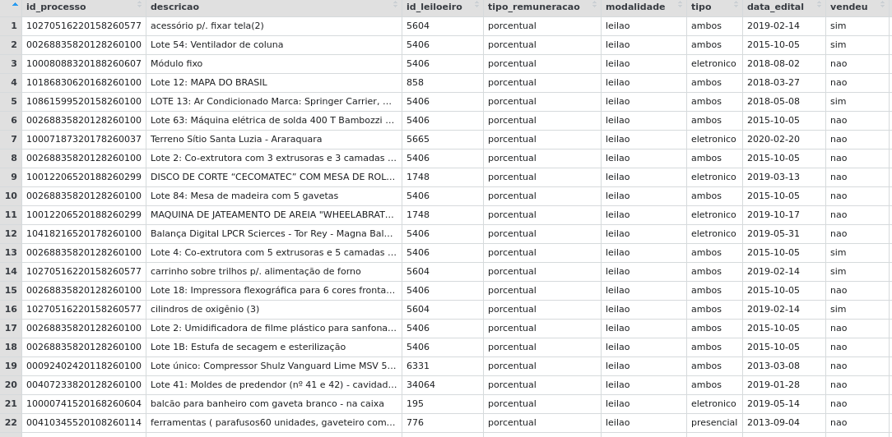

# Estatísticas {#estatisticas}

No capítulo anterior, vimos algumas questões essenciais por trás do método quantitativo. Neste capítulo vamos olhar para a estrutura dos dados e como resumir as informações a respeito desses dados. Para tanto, o capítulo está dividido em duas seções: (a) descrição das observações; (b) descrição do conjunto de observações.

Na seção sobre as observações, vamos ver como as bases de dados devem ser estruturadas e os tipos de dados possíveis. Na seção sobre a descrição do conjunto das observações, vamos ver as medidas que podem descrever conjuntos de observações, a saber, as medidas de posição, as medidas de variabilidade e as medidas de associação.

Os exemplos deste capítulo foram extraídos de duas bases de dados:

1. Base `consumo`: A base traz dados extraídos da jurisprudência do segundo grau no TJSP.
2. Base `leiloes`: A base leiloes traz dados que foram coletados no âmbito do Observatório da Insolvência - Fase 3 pela ABJ. Neste observatório, a ABJ coletou e analisou dados referentes a processos de falência distribuídos na Comarca de São Paulo, entre janeiro de 2010 e dezembro de 2020. 

Você pode acessar essas bases de dados baixando, no R, o pacote `{abjData}`.

```{r eval=FALSE}

# A base do boletim é
abjData::consumo

# A base de leilões é
abjData::leiloes
```

## Olhando para as observações

O que queremos compreender nesta seção é a natureza das *observações* de uma base de dados. As observações correspondem às unidades amostrais, que podemos definir como “*cada uma das partes disjuntas em que uma população é exaustivamente decomposta, para [que], do conjunto delas se façam extrações a fim de constituir uma amostra, ou estágio de uma amostra*”[^bolfarine]. __Em bases de dados, cada linha deve corresponder a uma unidade amostral; e cada coluna representa uma característica (também chamada de variável) dessa observação__.

[^bolfarine]: BOLFARINE, Heleno; BUSSAB, Wilton de Oliveira. __Elementos de Amostragem__. São Paulo: Blucher. 2005, p. 263

Na figura \@ref(fig:planilha), há um exemplo de uma base de dados da ABJ. São algumas linhas e colunas da base de leiloes do Observatório da Insolvência de São Paulo - Fase 2. Basicamente, esta base diz respeito aos bens que são levados a alienações nos processos de falência no Estado de São Paulo. Nessa base, cada linha representa um item levado a alienação de um processo, ou seja, a unidade amostral é um item levado a leilão; e cada coluna representa uma informação a respeito desse bem, a saber, quem é o leiloeiro responsável pela venda do bem, quando o bem foi levado a leilão, qual era o valor de avaliação inicial desse bem; e qual é o valor pelo qual ele foi arrematado (o que fica em branco, quando o bem nunca foi arrematado).

```{r planilha, fig.cap=""}

```

Uma *observação*, então, como vimos, possui várias características. Todas essas características constituem variáveis a respeito da unidade amostral. O que precisamos ver, a seguir, são os tipos dessas características e as implicações de cada um dos tipos. 

As variáveis podem pertencer a dois grupos: variáveis qualitativas (ou categóricas) ou variáveis quantitativas. As variáveis categóricas se subdividem ainda em nominais e ordinais; já as variáveis quantitativas podem ser do tipo discretas ou contínuas. 

### Variáveis qualitativas (categóricas)

Todas as variáveis qualitativas representam algum tipo de categoria (por isso também chamamos essas variáveis de “categóricas”). Há dois tipos de variáveis categóricas, as nominais e as ordinais. As variáveis nominais são categorias de nomes, categorias sem ordenação possível. Já as variáveis ordinais representam categorias com algum tipo de ordenação universal, com algum *ranking* possível. O critério de distinção entre essas duas variáveis é a possibilidade de *ordenação universal* das respostas possíveis.

A seguir, temos alguns exemplos que discutem se determinadas variáveis categóricas são nominais ou ordinais. 


1. __Unidade Federativa__: No Brasil, há 27 unidades federativas possíveis. É possível ordenar as unidades federativas, por exemplo, por ordem alfabética; ou até, se soubermos outras informações como PIB ou tamanho da população, podemos ordenar as UFs por algum critério outro. Apesar de essa variável ser *ordenável*, ela não pode ser ordenada a partir de um *critério universal*, ou seja, um critério intrínseco a ela mesma. Por isso, consideramos que UF é uma variável *nominal* (e não ordinal). 

1. __Assunto processual__: Os assuntos processuais são dados pelas Tabelas Processuais Unificadas (TPUs)[^sgt] do CNJ. Por mais haja uma numeração. Os assuntos também não possuem nenhuma ordenação universal. Portanto, esta é uma variável nominal. 

[^sgt]: Para saber mais informações, ver Resolução nº 46 do CNJ, bem como o site https://www.cnj.jus.br/sgt/consulta_publica_assuntos.php. 

1. __Valor de bens no leilão judicial (categorizado)__: Uma possível variável que pode existir em processos judiciais é uma classificação para o valor dos bens em um leilão. Podemos classificar os valores, por exemplo, como “insignificante”, “baixo”, “médio”, “alto”, “extravagante”. Neste caso, haveria uma ordenação intrínseca das categorias, sendo que “insignificante” é a categoria de menor valor e “extravagante”, a de maior valor. Assim sendo, esta variável é ordinal. 

1. __Resultado de uma sentença__: Uma sentença pode ter, de forma simplificada, três resultados possíveis: totalmente procedente, parcialmente procedente e improcedente. É um modelo simplificado, pois, para determinadas pesquisas, pode ser interessante diferenciar sentenças com julgamento de mérito de sentenças sem julgamento de mérito, ou de sentenças homologatórias. Por ora, vamos pensar apenas nessas três categorias. A questão que se põe é se há alguma ordenação universal entre essas três categorias ou não? 

Este caso pode gerar algumas dúvidas, pois poderíamos ordenar a sentença de tal forma que a sentença “totalmente procedente” fosse a mais valiosa, em relação à sentença “improcedente”. Entretanto, esse tipo de raciocínio pressupõe um valor intrínseco das sentenças, como se uma sentença “totalmente procedente” sempre fosse, de alguma forma, melhor do que uma sentença “improcedente”. O problema desse raciocínio é que, a depender do *polo da parte*, o valor da sentença é exatamente o oposto: para o réu, a sentença “improcedente” é a de menor valor, enquanto, para o autor, a sentença “totalmente procedente” é a de maior valor. 

Existem ainda mais ramificações dos tipos de variáveis qualitativas, por exemplo, variáveis intervalares, ou variáveis-razão. Essas demais ramificações não possuem muito uso prático no Direito, então não vamos nos aprofundar nelas. Há somente uma ramificação que ainda nos interessa que são as variáveis binárias, ou como são chamadas também, as variáveis *dummies*. As variáveis binárias só assumem dois valores possíveis, o valor de sucesso (representado numericamente pelo número `1`, ou pela condição `TRUE`) e o valor de fracasso (representado numericamente pelo número `0`, ou pela condição `FALSE`). Essas variáveis são importantes pois, como veremos no Capítulo \@ref(modelagem) é possível representar qualquer variável categórica em um conjunto de variáveis binárias. 


### Variáveis quantitativas

A outra grande categoria de variáveis é a de variáveis quantitativas. Esse grupo se caracteriza por ter variáveis de valores numéricos. Há uma classificação dicotômica importante a respeito desses valores. Existem variáveis quantitativas discretas e contínuas. 

As variáveis discretas são caracterizadas por valores numéricos que formam um conjunto finito ou enumerável de números. Usualmente, as variáveis desse tipo resultam de alguma *contagem*. Já as variáveis contínuas são valores numéricos que pertencem ao conjunto dos números reais. O critério de distinção entre essas duas categorias é a nossa capacidade de fazer uma correspondência dos números com o conjunto dos números naturais (0, 1, 2, ...).

A seguir, temos alguns exemplos se algumas variáveis são discretas ou contínuas. 

- __Valor da causa__: Em um exemplo anterior (no caso do valor dos bens dos leilões), estávamos tratando de valores também, mas estávamos tratando de valores agrupados formando categorias. Agora vamos falar dos valores brutos, individualizados, e não das categorias a que eles pertencem. O valor da causa pode assumir incontáveis valores, não sendo, portanto, um valor enumerável. Assim sendo, ele é uma variável *contínua*.

- __Quantidade de partes em cada polo__: No caso de litisconsórcio ativo ou passivo, é possível contar quantas partes existem em cada polo. Essa informação pode ser relevante, por exemplo, ao se estudar direitos difusos e coletivos, pois pode ser importante saber quantas pessoas estão no polo ativo da demanda, para determinar se é uma demanda coletiva ou pseudo-coletiva[^pseudocoletiva]. A variável sobre a quantidade de partes em cada polo será do tipo *discreta*. 

[^pseudocoletiva]: Usa-se aqui a distinção de GRINOVER, Ada Pellegrini (coord.). __Avaliação da Prestação Jurisdicional Coletiva e Individual a partir da Judicialização da Saúde__. Relatório de pesquisa. São Paulo: CEBEPEJ. 2014.

### Considerações sobre os tipos de dados

Antes de prosseguir para as medidas desses dados, devemos fazer algumas considerações. 

O primeiro ponto a se destacar é sobre a representação numérica de variáveis categóricas ordinais. Vamos usar o exemplo de uma proposta do Center for *Court Innovation* de Nova Iorque[^newyork]. Uma das iniciativas desse centro foi tornar os tribunais de Nova Iorque mais “amigáveis”. Uma das técnicas propostas para tanto foram os Questionários de Satisfação sobre a prestação jurisdicional. O Quadro X resume algumas das perguntas do questionário elaborado pelo *Centro*. 

[^newyork]: CENTER FOR COURT INNOVATION. __Can Courts Be More User-Friendly? How Satisfaction Surveys Can Promote Trust and Access to Justice__. 2020. Disponível em: https://www.courtinnovation.org/sites/default/files/media/document/2020/CCI_FactSheet_SatisfactionSurveys_04202020.pdf 

```{r}
c1 <- c("Concordo fortemente", "Concordo", "Neutro", "Discordo", "Discordo fortemente")
c2 <- c("O juiz compreendeu minha demanda",
        "O juiz levou a minha demanda a sério",
        "De forma geral, obtive o resultado esperado no tribunal",
        "Fui tratado com respeito pelo tribunal",
        "Fui tratado de forma justa pelo tribunal",
        "Eu pediria a ajuda ao tribunal no futuro, se necessário")

purrr::cross_df(list(`-` = c2, name = c1)) |> 
  dplyr::mutate(value = "") |> 
  tidyr::pivot_wider() |> 
  knitr::kable(
    caption = "Perguntas selecionadas de um questionário de satisfação"
  )

```


Ao aplicar um questionário desses, estamos produzindo *dados*. A aplicação de vários questionários sucessivamente levaria à produção de uma base de dados em que cada linha (unidade amostral) seria um respondente, e cada coluna seria uma das perguntas. Todas essas perguntas recebem como resposta o nível de satisfação (concordo fortemente, concordo, neutro, discordo e discordo fortemente), sendo, portanto, variáveis de natureza *categórica ordinal*, pois há claramente uma ordem entre essas respostas.

O que queremos é discutir uma proposta de substituição dessas respostas para uma forma *numérica*. Como há uma ordem entre essas respostas, será que poderíamos olhar para elas de forma numérica? A transformação seria a seguinte:

- Concordo fortemente: 1
- Concordo: 2
- Neutro: 3
- Discordo: 4
- Discordo fortemente: 5

Essa transformação deve ser feita com cuidado. Por um lado, esse tipo de alteração não altera a ordenação dessas respostas. Entretanto, por outro lado, a representação numérica das categorias ordinais adiciona uma informação aos dados que não é verdadeira: a intensidade. O que estamos dizendo é que os números guardam, não só uma ordenação universal entre si, assim como as variáveis categóricas ordinais, mas eles guardam uma relação de intensidade entre si, algo que as variáveis categóricas ordinais não possuem. Assim, enquanto podemos dizer que o número 2 é o dobro do número 1, não podemos estabelecer essa relação entre as categorias “concordo” e “concordo totalmente”. 

A segunda consideração que queremos fazer diz respeito à transformação das categorias nominais em variáveis *dummies*. Vamos tomar outro caso como exemplo para esta discussão. 

No projeto que a ABJ realiza, em parceria com o CNJ, sobre adoção, tentamos auxiliar os pretendentes a escolherem o perfil da criança fornecendo a eles uma informação importante: o tempo que irá demorar adotar uma criança a depender do perfil escolhido para ela. Perfis mais restritivos em geral demoram mais tempo do que perfis mais permissivos. A questão é deixar claro que características importam para a mudança do tempo e o quanto cada característica importa para o tempo. Uma das variáveis é a variável de `tp_etnia`. Essa variável indica qual é a preferência de etnia preferida dos pretendentes em relação às crianças a serem adotadas. Há 6 respostas possíveis: A (de “amarelo”), B (de “branco”), I (de “indígena”), N (de “negro”), P (de “pardo”) ou S (de “sem preferência”). Essas categorias não possuem um critério de ordenação universal, assim sendo, a variável `tp_etnia` é do tipo categórico nominal. Temos um exemplo dessa base na Figura \@ref(fig:etnia). Os valores usados são fictícios, por questões de sigilo da base. 

```{r etnia, fig.cap="Variávei categórica da base de dados."}
knitr::kable("assets/img/etnia.png")
```


A questão de que queremos tratar é como transformar a `tp_etnia` em um formato dummy? Para realizar essa transformação, nós transformamos cada uma das etnias em uma variável que recebe apenas as respostas 0 ou 1. Mas temos que tomar um cuidado muito importante: __a quantidade de variáveis que criamos__ é sempre o número de categorias ($n$) menos 1, ficando $n-1$. No caso, como são 6 categorias possíveis, criamos n-1 variáveis, isto é, 5 variáveis. A base resultante está na Figura X.

```{r etnia-dummy, fig.cap="Variávei categórica da base de dados na forma de variáveis binárias."}
knitr::kable("assets/img/etnia_dummy.png")
```

A questão importante dessa consideração era justamente chamar a atenção para o fato de que a quantidade de *dummies* criadas a partir da categorias é $n-1$. Isso não é uma escolha arbitrária, mas tem uma razão de ser. Mais para frente do livro, veremos que, se criássemos $n$ categorias, ao invés de $n-1$, teríamos um problema chamado multicolinearidade. Entretanto, por hora, de forma simplificada, podemos simplesmente afirmar que a categoria que foi deixada de fora, isto é, a categoria que não se transformou em dummy pode ser presumida. 

	Vejamos na Figura \@ref(fig:etnia-dummy) que a categoria deixada de lado foi “S” (ou “sem preferência”). Entretanto, conseguimos identificar um pretendente que não possui preferência por nenhuma etnia quando todas as dummies são iguais a 0. Assim, se A = 0; B = 0; I = 0; N = 0; e P = 0, então teríamos (caso essa categoria existisse) que S = 1. Dizer que S = 1 equivale a dizer que todas as outras categorias são iguais a 0. Justamente por haver essa fungibilidade entre a representação de S = 1 com tudo = 0 que não criamos exatamente $n$ dummies, mas $n-1$. O que deve ficar de lição é que a categoria deixada de lado está presumida pela resposta às demais dummies; ela estará presente sempre que todas as outras categorias forem 0. 
