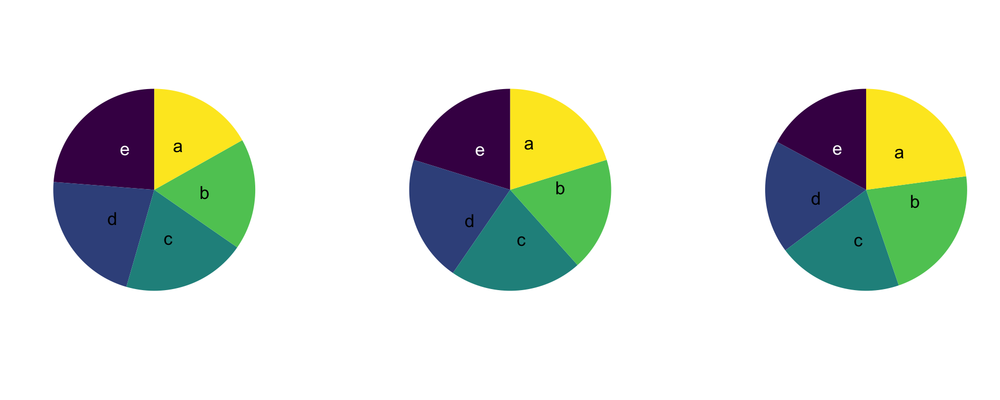

# Visualização {#visualizacao}

No capítulo \@ref(planejamento), nós vimos questões sobre o método quantitativo, já no capítulo \@ref(estatisticas), passamos do método às medidas. Nesta ocasião, vimos as medidas de duas formas diferentes: as medidas das observações consideradas individualmente e as medidas de resumo do conjunto de observações. Na parte das medidas individuais de cada observação, vimos que as características das observações podem ter duas naturezas distintas, ou elas são categóricas (pois indicam uma categoria de resposta), ou elas são quantitativas (pois indicam uma resposta numérica). Essas duas naturezas possíveis possuem suas subdivisões, mas o mais importante é considerarmos essas duas grandes classes. Em seguida, na parte de medidas resumo do conjunto das observações, tivemos que separar as medidas resumo das variáveis categóricas das medidas resumo das variáveis quantitativas.  

Neste capítulo, ainda vamos nos valer desta distinção – entre variáveis categóricas e numéricas –, mas não vamos falar de medidas de resumo. O foco deste capítulo são as visualizações relacionadas a cada tipo de dado. Inicialmente, precisamos discutir para que servem as visualizações suas vantagens e desvantagens. Em seguida, vamos falar das visualizações específicas de cada tipo de variável (categórica ou quantitativa), começando pelas visualizações das variáveis categóricas para seguir então para as visualizações das variáveis quantitativas. Depois de olhar como representar individualmente as variáveis, vamos olhar para gráficos bivariados. 

## Para que servem visualizações?

Hoje em dia, nós vemos gráficos em vários contextos da vida cotidiana. Vemos gráficos em jornais, apresentações, livros, artigos de revista e em um monte de outros lugares. Mas nem sempre foi assim. Tratar de *dados* por meio de *visualizações gráficas* é apenas um jeito de contar a história. No capítulo anterior, vimos como contar a história, não por meio de gráficos, mas por meio de medidas de resumo. Se os gráficos nem sempre foram utilizados, cabe nos perguntarmos por que eles ganharam essa relevância nos dias atuais? O que eles trazem que outras formas de comunicar as informações (como em tabelas) não trazem?

Vamos começar essa discussão com uma citação importante, retirada do livro The *Elements of Graphing Data* [Os Elementos da Representação Gráfica dos Dados] (1985) do William S. Cleveland. Na sessão *the power of graphical display* [o poder da representação gráfica], Cleveland diz:

> Representações gráficas são uma ferramenta excepcional para a análise de dados. A razão disso está bem resumida em uma sentença de uma carta de 1982 escrita pelo senhor W. Edwards Deming a mim: "Os métodos gráficos podem reter a informação nos dados". Procedimentos numéricos de análise de dados – tais como a média, o desvio padrão, coeficientes de correlação e teste-t – são essencialmente técnicas de redução dos dados. Os métodos gráficos complementam essas técnicas. Os métodos gráficos tendem a mostrar conjuntos de dados como um todo, permitindo-nos resumir o comportamento geral e estudar o detalhe. Isso nos leva a uma análise de dados mais minuciosa. 
Uma razão para as representações gráficas conseguirem reter as informações dos dados é que uma grande quantidade de informação quantitativa pode ser exibida e absorvida[^cleveland].
  
[^cleveland]: @Cleveland1985, pp. 9-10, tradução livre, grifos no original
  No original: "Graphs are exceptionally powerful tools for data analysis. The reason is nicely encapsulated in a sentence from a 1982 letter written to me by W. Edwards Deming: "Graphical methods can retain the information in the data." Numerical data analytic procedures – such as means, standard deviations, correlation coefficients, and t-tests – are essentially data reduction techniques. Graphical methods complement such numerical techniques. Graphical methods tend to show data sets as a whole, allowing us to summarize the general behavior and to study detail. This leads to much more thorough data analysis.
  One reason why graphical displays can retain the information in the data is that a large amount of quantitative information can be displayed and absorbed."

Para dar um exemplo do que significa conseguir exibir e absorver informações quantitativas, e para explicar também o que significa "técnicas de redução de dados", vamos olhar para um exemplo, no qual nós comparamos três formas de apresentar os mesmos dados. Os dados expostos dizem respeito aos valores das causas de ações de consumo. 

```{r}

consumo <- abjData::consumo
set.seed(20)
da <- consumo |>
  dplyr::sample_n(100) |>
  dplyr::select(valor)

da2 <- cbind(
  da[1:20, ],
  da[21:40, ],
  da[41:60, ],
  da[61:80, ],
  da[81:100, ])

htmlTable::htmlTable(
  da2,
  header = c("", "", "valor", "", ""),
  rnames = FALSE
)

```


```{r}
da_resumo <- da |>
  dplyr::summarise(
    `média` = mean(valor),
    `desvio padrão` = sd(valor),
    `mínimo` = min(valor),
    `quartil inferior` = quantile(valor, 0.25),
    `mediana` = median(valor),
    `quartil superior` = quantile(valor, 0.75),
    `máximo` = max(valor)
    ) |>
  dplyr::mutate(dplyr::across(
    everything(),
    ~round(.x, 2))
    ) |>
  tibble::rownames_to_column() |>
  dplyr::mutate(rowname = "valores") |>
  tidyr::pivot_longer(!rowname, names_to = "medidas", values_to = "valores") |>
  tidyr::pivot_wider(names_from = "rowname", values_from = "valores") |> 
  dplyr::mutate(valores = abjutils::reais(valores))

da_resumo |>
  knitr::kable(
    caption = "Medidas de resumo"
  )
```

```{r exemplo-vis, fig.width=8, fig.height=2.5, fig.cap="Exemplo de visualizacao"}
options(scipen = 999)
da |>
  ggplot2::ggplot() +
  ggplot2::aes(x = valor) +
  ggplot2::geom_histogram(fill = cores_abj[1], bins = 60)
```

As três apresentações de dados que fizemos foram, respectivamente, uma tabela de observações, apresentando 100 valores de causa em ações de consumo; seguido das medidas resumo dessas observações; finalizando com um histograma dessas observações. O que queremos discutir é *o que a apresentação gráfica nos mostra que as demais formas não nos mostram*?

A primeira apresentação dos dados nos diz muito pouco. Por mais que tenhamos uma visão de *todos* os dados, não conseguimos tirar conclusão alguma sobre eles. As informações ali estão muito cruas. 


Na segunda forma de apresentar os dados, todo aquele conjunto imenso de dados foi reduzido a algumas poucas estatísticas de resumo. No caso, escolhemos mostrar a média, o desvio padrão e algumas medidas de posição importantes (o mínimo, o máximo, os quartis inferior e superior e a mediana). Nesse caso, perdemos a noção do *todo* (pois não vemos mais cada uma das observações), para olharmos para tendências gerais. Essas medidas nos permitem olhar para algumas tendências importantes, por exemplo, conseguimos perceber que, como a média está mais à direita do que a mediana, pois R\$ 17.654,10 (média) é maior do que R\$ 12.421,81 (mediana), que a distribuição não é simétrica, mas que existem pontos à direita que estão "puxando" a média para a direito, enquanto a mediana, que é robusta como vimos, não está recebendo efeito dessas observações à direita. Confirmamos essa mesma tendência pela observação de que o desvio padrão é muito maior do que a média. 

Todas essas conclusões que tiramos a partir das medidas resumo nos levam a perceber que a distribuição dos valores de causa de ações de consumo possui uma distribuição assimétrica para a direita (ou seja, muitos dados concentrados próximo de zero, e poucos dados muito distantes do zero). Acontece que o processo para chegarmos a essa conclusão não foi intuitivo, ele necessitou de algumas análises anteriores.

É com esse problema em mente que podemos olhar para o gráfico que está apresentando os mesmos dados. Duas características são importantes da representação gráfica pelo histograma: (a) o gráfico não "reduz" os dados a algumas poucas medidas, mas ele exibe todas as observações, aproximando-se, dessa forma, da primeira apresentação dos dados (isto é, a tabela de observações); (b) ao mesmo tempo em que o gráfico mostra *todas* as observações, ele ainda consegue indicar tendências gerais da distribuição dos dados, nesse sentido, aproximando-se da segunda apresentação dos dados (isto é, a tabela de medidas resumo). Aquela conclusão que tiramos a partir das medidas resumo (de que a distribuição é assimétrica para a direita, pois ela possui muitos dados concentrados próximo de zero e poucos dados distantes do zero) é reforçada no gráfico. A diferença é que conseguimos chegar a essa conclusão de uma forma muito mais intuitiva. É por essa razão que Cleveland diz que "uma grande quantidade de informação quantitativa pode ser exibida e **absorvida**", com destaque para a palavra "absorvida". 

A partir desse exemplo, conseguimos compreender algumas características importantes das visualizações gráficas: elas conseguem manter um olhar para *cada uma das observações* (sem reduzir os dados a algumas poucas medidas), e conseguem apresentar tendências gerais da distribuição do dado de uma forma de fácil absorção e compreensão por aquele que visualiza.

Com essas características em mente, então, podemos começar a responder à pergunta "para que servem visualizações?". Há duas respostas importantes: as visualizações gráficas servem para investigar os dados, bem como servem para comunicar resultados. Vamos olhar para as duas funções

### Detetive de dados - Análise exploratória de dados

Uma forma de encarar as visualizações gráficas é criar visualizações a fim de se obter evidências e pistas para analisar outros fenômenos. Isso é o que @Tukey1977 chama de "quantitative detective work" [trabalho de detetive quantitativo]. Nesse sentido, a visualização de dados não é um fim em si mesmo, mas é uma etapa para um processo de compreensão maior. Nesse sentido, usamos visualizações gráficas para descobrir como um determinado dado se distribui; e a partir dessa informação, podemos perceber que talvez seja adequado fazer uma transformação de variável. Por exemplo, ao analisar o valor da causa, podemos nos deparar com a seguinte distribuição, conforme a Figura \@ref(fig:hist-causa).

```{r hist-causa, fig.cap="Distribuição do valor da causa"}
cores_abj <- c("#102C68", "#AFCA0A", "#575756")

p_sem_log <- consumo |>
  ggplot2::ggplot() +
  ggplot2::aes(x = valor) +
  ggplot2::geom_histogram(fill = cores_abj[1], bins = 30)

p_sem_log
```

Não queremos colocar um gráfico desses em um relatório, ou em um artigo a ser publicado. Mas esse gráfico é importante para percebemos que o eixo x (valor) precisa passar por um ajuste. O ajuste que vamos fazer é colocar o valor em escala logarítmica. Essa é uma transformação muito comum. Mais para frente veremos por que, quando e como fazer essa transformação, por hora, basta sabermos que o primeiro gráfico foi um indicativo de que precisávamos mudar a escala da variável `valor`. Esse gráfico conseguiu nos indicar isso pois ele nos revelou a distribuição das observações sobre essa variável. E ao saber a distribuição, conseguimos padronizar melhor os dados. Na Figura \@ref(fig:hist-causa-log), vemos as mesmas informações dispostas na Figura \@ref(fig:hist-causa), ajustadas com log. 

```{r hist-causa-log, fig.cap="Distribuição do valor de causa (com log);"}
p_com_log <- consumo |>
  dplyr::mutate(valor_log = log10(valor)) |>
  ggplot2::ggplot() +
  ggplot2::aes(x = valor_log) +
  ggplot2::geom_histogram(fill = cores_abj[1], bins = 50) +
  ggplot2::scale_x_continuous(
    breaks = 0:10, 
    labels = 10^c(0:10)
  )

p_com_log
```

A partir da Figura \@ref(fig:hist-causa-log), conseguimos observar uma distribuição totalmente diferente daquela expressa na Figura \@ref(fig:hist-causa). Essa nova figura tem alguns problemas de interpretação, por exemplo, o que significa que o valor da causa ser log 8? A informação não está equivocada, mas ela só está de difícil interpretação. O que queríamos mostrar é que a Figura \@ref(fig:hist-causa) foi usada, não para apresentar os dados que ela continha, mas como um meio para chegarmos à Figura \@ref(fig:hist-causa-log). 
São usos deste tipo que aqui estamos chamando de uma análise exploratória de dados. Nesse sentido (de exploratório), os gráficos servem de instrumento de investigação de relações. Veremos ao longo do livro várias formas de usar gráficos nesse sentido, tais como testes de normalidade, verificar pressupostos de modelos, descobrir outliers, entre muitos outros. 

## Comunicadora de dados - Apresentação de dados

Outra função que podemos dar à visualização de dados é a comunicação dos resultados. Bons gráficos devem ser gráficos que consigam ser facilmente compreendidos; são gráficos claros e intuitivos. Existem uma série de estudos sobre como construir gráficos para comunicação, assim como existem muitos exemplos, principalmente no jornalismo, de gráficos que contam boas histórias. 

:::
Recomendamos aqui a leitura de Cleveland, William S. The Elements of Graphing Design. California: Wadsworth Advanced Book Program. 1985; ou para um resumo e aplicação prática de Cleveland, recomendamos Kozak, Marcin. Basic principles of graphing data. Sci. Agric. (Piracicaba, Braz.), v.67, n.4, p.483-494, July/August 2010. Neste artigo de Kozak, ele resume os princípios elencados por Cleveland em The Elements of Graphing Data, bem como fornece valiosos exemplos de como esses princípios podem melhorar a apresentação gráfica.
:::

:::
Aqui recomendamos os gráficos do Nexo Jornal, disponíveis em: https://www.nexojornal.com.br/grafico/; a sessão Igualdades da Revista Piaui, disponível em: https://piaui.folha.uol.com.br/tag/igualdades/; os gráficos do New York Times, disponíveis em: https://www.nytimes.com/spotlight/graphics; as reportagens do Núcleo de Jornalismo https://www.nucleo.jor.br/; e, por fim, esta reportagem do Estadão sobre adoção de crianças https://arte.estadao.com.br/brasil/adocao/criancas/. Todos os sites foram acessados em 28/04/2022.
:::


Temos que ter alguns cuidados nessa parte de comunicação dos resultados. A comunicação é uma etapa que, se feita de forma equivocada, pode não conseguir passar a interpretação correta dos resultados, ou ainda, se for feita de forma maliciosa, pode passar informações falsas.

:::
Ver o exemplo discutido por Cleveland, 1985, sobre o gráfico que o Carl Sagan apresentou em seu livro Os Dragões do Éden a respeito da relação entre a proporção da massa do cérebro em relação à massa do corpo e a inteligência de diversas espécies. O exemplo se encontra em na sessão 1.3. The Challenge of Graphical Display do livro Cleveland, William S. The Elements of Graphing Design. California: Wadsworth Advanced Book Program. 1985. 
:::

:::
Ver o artigo de Caio Lente no blog da Curso-R, em que ele descreve como os dados podem mentir, ao se analisar uma imagem sobre o desenvolvimento econômico da Argentina após a Reforma Constitucional que ensejou o início da Justiça Social. O artigo está disponível em: https://blog.curso-r.com/posts/2020-01-21-fake-news/, acessado em 28/04/2022. 
:::

## Visualizações em espécie

Tendo em mente as características e funções das visualizações, podemos prosseguir ao detalhamento de algumas espécies de visualizações. Existem muitos tipos de gráficos. Você pode ver uma tentativa de documentação completa desses gráficos em [From data to Viz](https://www.data-to-viz.com/). Não vamos falar de todos esses gráficos, mas apenas dos tipos mais frequentes. Da mesma forma como nós dividimos a explicação das medidas de resumo entre as explicações das medidas para variáveis categóricas e as medidas para variáveis numéricas, vamos, novamente, seguir este padrão, de modo que apresentaremos:


1. Visualizações para variáveis categóricas
    1. Gráficos univariados
    1. Gráficos bivariados
        1. Com explicativa categórica
        1. Com explicativa numérica (só faz sentido regressão)
1. Visualizações para variáveis numéricas
    1. Gráficos univariados
    1. Gráficos bivariados
        1. Com explicativa categórica
        1. Com explicativa numérica

Para cada gráfico, iremos ver (i) como desenhar o gráfico e (ii) como interpretá-lo. A explicação do ponto (i) já diz muito sobre o ponto (ii), mas iremos tentar discriminar cada uma das análises especificamente. 

Algumas explicações que precisamos dar a respeito dessas visualizações. Primeiro, o que significa ser um gráfico univariado ou bivariado? 

Um gráfico univariado representa apenas uma única variável nele. Isso **não significa que** o gráfico tenha apenas um eixo. Na verdade, os gráficos univariados normalmente têm dois eixos. Então a quantidade de variáveis não diz exatamente respeito à quantidade de eixos.

Já o gráfico bivariado representa duas variáveis nele, em que uma variável é a variável resposta e a outra variável é a variável explicativa. A variável resposta é aquela que  nós queremos compreender; e a variável explicativa é a variável que queremos explicar a variável resposta. 

Vamos dar um exemplo para compreender o que são as variáveis explicativa e resposta. Se formos analisar a instância recursal, podemos querer ver se a reforma da decisão de primeiro grau é afetada pelo valor da causa. Será que causas de valores maiores tendem a ser menos reformadas? Veja que a relação que queremos avaliar tem uma ordem certa: importa dizer que é o valor da causa que explica a reforma, e não o contrário, de que é a reforma da sentença ou não que explica o valor da causa. Essas duas relações são possíveis de serem analisadas (apesar de que faz pouco sentido teórico explicar o valor da causa pela reforma). O importante é notar que essas duas relações são distintas, e aquilo em que elas se distinguem é justamente o que cada uma delas considera como variável resposta e como variável explicativa. Na pergunta de se a reforma da sentença é afetada pelo valor da causa, a variável "reforma" é a variável resposta (ou seja, a variável que queremos compreender); e a variável "valor da causa" é a variável explicativa (ou seja, a variável que queremos que explique a variável resposta). Em termos matemáticos, a variável resposta é a variável Y e a variável explicativa é a variável X.

### Visualizações de variáveis categóricas

#### Gráficos univariados

Os gráficos univariados de variáveis categóricas são marcados por conterem sempre duas informações: as categorias analisadas e a contagem ou proporção dessas categorias. Por mais que os gráficos tenham duas dimensões, eles não contém duas “variáveis”. A única variável são as categorias; a contagem/proporção é simplesmente um atributo dessa variável. Vamos ver duas visualizações mais difundidas desse tipo de variável. Para mais exemplos, ver [From data to Viz](https://www.data-to-viz.com/).

##### Gráfico de barras

O gráfico de barras é o principal meio de visualizar variáveis categóricas. Ele contém dois eixos: a variável categórica e a contagem/proporção. Não importa o eixo em que cada uma dessas informações está. A variável pode ser apresentada tanto no eixo x (horizontal), como no eixo y (vertical, também chamado de gráfico de colunas), conforme a Figura \@ref(fig:vis-barras).

```{r vis-barras, fig.cap="Gráficos de barras"}
cores_abj <- c("#102C68", "#AFCA0A", "#575756")

consumo <- abjData::consumo |>
  dplyr::filter(dec_val == "Reformou" |
                  dec_val == "Parcial" |
                  dec_val == "Não reformou")

# gráfico de barras (univariado) ------------------------------------------

bar_vert1 <- consumo |>
  dplyr::count(dec_val) |>
  dplyr::mutate(prop = n / sum(n)) |>
  dplyr::mutate(dec_val = stringr::str_replace_all(dec_val, "/", "/ \n")) |>
  ggplot2::ggplot() +
  ggplot2::aes(y = dec_val, x = n) +
  ggplot2::geom_col(fill = cores_abj[1]) +
  ggplot2::ylab("Decisão de segunda instância") +
  ggplot2::xlab("Quantidade")


bar_hor1 <- consumo |>
  dplyr::count(dec_val) |>
  dplyr::mutate(prop = n / sum(n)) |>
  dplyr::mutate(dec_val = stringr::str_replace_all(dec_val, "/", "/ \n")) |>
  ggplot2::ggplot() +
  ggplot2::aes(x = dec_val, y = n) +
  ggplot2::geom_col(fill = cores_abj[1]) +
  ggplot2::xlab("Decisão de segunda instância") +
  ggplot2::ylab("Quantidade")

patchwork::wrap_plots(bar_vert1, bar_hor1) +
  patchwork::plot_annotation(title = "Gráficos de barras na vertical e na horizontal")

```

O gráfico é simples, bem como a sua interpretação. Basta verificar a contagem de cada categoria. Usualmente, tira-se desses gráficos a conclusão de quais grupos são mais relevantes, qual é a tendência de resposta de determinada categoria. No caso em tela, observamos que os processos de consumo, em segunda instância, tendem a não ser reformados. 

##### Gráfico de setores (pizza)

O segundo tipo de visualização categórica são os gráficos de setores, ou gráficos de pizza (ou *pie charts*, em inglês). Esta visualização é uma forma muito frequente de apresentar os dados. A diferença dos gráficos de pizza para os gráficos de barras é que eles apresentam informações dispostas, não lado a lado, mas dentro de um círculo. O círculo inteiro compreende todas as observações possíveis, enquanto as suas ramificações (ou pedaços de pizza) representam a parcela do todo que diz respeito a uma determinada categoria. 

Esse gráfico, apesar de ser amplamente utilizado, ele traz um problema de visualização. Por mais que o gráfico funcione bem para representar duas ou três categorias, com mais categorias do que isso ele passa a não ser muito funcional. 

Aqui vamos replicar o exemplo elaborado pelo Data to Viz em [The issue with pie chart](https://www.data-to-viz.com/caveat/pie.html). O exemplo que eles dão parte da seguinte pergunta: Tente descobrir nos três grupos abaixo qual é o grupo com mais observaçẽs.

```{r}

```


A resposta deveria ser, para a primeira pergunta, que no primeiro gráfico, o maior grupo é o E; no segundo, o C; e no terceiro, o A. Acontece que, por causa da forma como os dados estão dispostos, é difícil chegar a essa conclusão, enquanto, se repetíssemos a pergunta para os mesmos dados dispostos em barras, essa pergunta seria trivial.

```{r}
knitr::include_graphics("assets/img/bar-datatoviz.png")
```
Então, a questão com os gráficos de pizza é que eles possuem um iminente problema de comunicação e interpretação. A assimilação desses gráficos não é intuitiva, muitas vezes, sequer possível a olho nu. Dessa forma, deve-se preferir, na maioria das vezes, a utilização de gráficos de barras no lugar de gráficos de pizza. Recomenda-se que se utilize gráficos de pizza para representar 2 ou, no máximo, 3 categorias. Mais do que isso, a visualização fica prejudicada. 

#### Gráficos bivariados (com explicativa categórica)

##### Gráfico de barras

O mesmo gráfico de barras que pode representar uma única variável, pode ser usado para representar duas variáveis categóricas. Neste caso, não mudamos os eixos. O que fazemos, no lugar, é “quebrar” cada uma das categorias do eixo categórico em algum subgrupo. Por exemplo, na Figura \@ref(fig:barras-2var), pegamos as categorias referentes a “decisões de segunda instância” e quebramos pelo tipo de litígio. Há 4 tipos de litígio possíveis: uma pessoa física (PF) no polo ativo contra alguma não-pessoa física (nPF), tal como uma empresa, um espólio ou o Poder Público (PF-nPF); uma pessoa física contra outra pessoa física (PF-PF); uma pessoa não física no polo ativo, contra uma pessoa física (nPF-PF); ou uma disputa entre duas pessoas não físicas (nPF-nPF).

```{r barras-2var, fig.width=12, fig.height=3.5, fig.cap="Gráficos de barras com duas variáveis, empilhado."}
bar_vert1 <- consumo |>
  dplyr::count(dec_val) |>
  dplyr::mutate(prop = n / sum(n)) |>
  dplyr::mutate(dec_val = stringr::str_replace_all(dec_val, "/", "/ \n")) |>
  ggplot2::ggplot() +
  ggplot2::aes(y = dec_val, x = n) +
  ggplot2::geom_col(fill = cores_abj[1]) +
  ggplot2::ylab("Decisão de segunda instância") +
  ggplot2::xlab("Quantidade")

bar_vert2 <- consumo |>
  dplyr::count(dec_val, tipo_litigio) |>
  dplyr::mutate(prop = n / sum(n)) |>
  dplyr::mutate(dec_val = stringr::str_replace_all(dec_val, "/", "/ \n")) |>
  ggplot2::ggplot() +
  ggplot2::aes(y = dec_val, fill = tipo_litigio, x= n) +
  ggplot2::geom_col() +
  ggplot2::labs(
    x = "Decisão de segunda instância",
    y = "Quantidade"
  ) +
  ggplot2::scale_fill_viridis_d(begin = .2, end = .8) +
  ggplot2::theme(
    legend.position = c(0.95, 0.95),
    legend.justification = c("right", "top"),
    legend.box.just = "right",
    legend.margin = ggplot2::margin(6, 6, 6, 6),
    legend.background = ggplot2::element_rect(fill = "white", color = "black")
  ) +
  ggplot2::guides(fill=ggplot2::guide_legend("Tipo de litígio", nrow=2, byrow=TRUE))


patchwork::wrap_plots(bar_vert1, bar_vert2) +
  patchwork::plot_annotation(
    title = "Gráficos de barras na vertical quebrado em uma segunda variável"
  )
```
Essa “quebra” pode ser feita de diversas maneiras. A escolha entre cada uma delas dependerá dos propósitos do gráfico, ou até mesmo do estilo do próprio pesquisador. A Figura \@ref(fig:barras-2var2) traz outra forma de realizar essa quebra.

```{r barras-2var2, fig.width=8, fig.height=7, fig.cap="Gráficos de barras com duas variáveis, lado a lado."}
bar_hor <- consumo |>
  dplyr::count(dec_val) |>
  dplyr::mutate(prop = n / sum(n)) |>
  dplyr::mutate(dec_val = stringr::str_replace_all(dec_val, "/", "/ \n")) |>
  ggplot2::ggplot() +
  ggplot2::aes(x = dec_val, y = n) +
  ggplot2::geom_col(fill = cores_abj[1]) +
  ggplot2::labs(
    x = "Decisão de segunda instância",
    y = "Quantidade"
  ) +
  ggplot2::theme(
    legend.position = c(0.95, 0.95),
    legend.justification = c("right", "top"),
    legend.box.just = "right",
    legend.margin = ggplot2::margin(6, 6, 6, 6),
    legend.background = ggplot2::element_rect(fill = "white", color = "black")
  ) +
  ggplot2::guides(fill=ggplot2::guide_legend("Tipo de litígio", nrow=2, byrow=TRUE))


bar_hor2 <- consumo |>
  dplyr::count(dec_val, tipo_litigio) |>
  dplyr::mutate(prop = n / sum(n)) |>
  dplyr::mutate(dec_val = stringr::str_replace_all(dec_val, "/", "/ \n")) |>
  ggplot2::ggplot() +
  ggplot2::aes(x = dec_val, fill = tipo_litigio, y= n) +
  ggplot2::geom_col(position = 'dodge') +
  ggplot2::labs(
    x = "Decisão de segunda instância",
    y = "Quantidade"
  ) +
  ggplot2::scale_fill_viridis_d(begin = .2, end = .8) +
  ggplot2::theme(
    legend.position = c(0.95, 0.95),
    legend.justification = c("right", "top"),
    legend.box.just = "right",
    legend.margin = ggplot2::margin(6, 6, 6, 6),
    legend.background = ggplot2::element_rect(fill = "white", color = "black")
  ) +
  ggplot2::guides(fill=ggplot2::guide_legend("Tipo de litígio", nrow=2, byrow=TRUE))

patchwork::wrap_plots(bar_hor1, bar_hor2, ncol = 1) +
  patchwork::plot_annotation(
    title = "Gráficos de barras na horizontal quebrado em uma segunda variável"
  )


```

O que precisamos compreender é a complexidade que essa segunda variável adiciona à interpretação do gráfico. No gráfico de barras univariado, podíamos comparar apenas o tamanho de cada um dos desfechos da sentença. Na Figura \@ref(fig:highlight-barras), damos um exemplo de um tipo de comparação possível a partir do gráfico univariado, em que comparamos os os grupos “Reformou” com “Não reformou”. 

```{r highlight-barras, fig.cap="Gráfico de barras com comparação entre os grupos 'Reformou' e 'Não reformou'"}
consumo |>
  dplyr::count(dec_val) |>
  dplyr::mutate(
    prop = n / sum(n),
    dec_val = stringr::str_replace_all(dec_val, "/", "/ \n"),
  ) |>
  ggplot2::ggplot() +
  ggplot2::aes(x = dec_val, y = n) +
  ggplot2::geom_col(fill = cores_abj[1]) +
  ggplot2::labs(
    title = "Gráfico de barras com comparação entre os grupos 'Reformou' e 'Não reformou'",
    x = "Decisão de segunda instância",
    y = "Quantidade"
  ) +
  gghighlight::gghighlight(
    dec_val == "Reformou" | dec_val == "Não reformou"
  )

```

Com os gráficos de barras bivariados, outras comparações são possíveis. No caso, podemos realizar 2 novas comparações. A primeira comparação possível é aquela em que fixamos a variável de interesse para compararmos a variável explicativa. No nosso caso, isso significa comparar, dentro de um único desfecho da sentença, alguns tipos de litígio. Vemos um exemplo desta comparação na Figura \@ref(fig:highlight-bivar).

```{r highlight-bivar, fig.cap="Contagens de não reforma e configuração das partes."}
consumo1 <- consumo |>
  dplyr::count(dec_val, tipo_litigio) |>
  dplyr::transmute(
    dec_val = stringr::str_replace_all(dec_val, "/", "/ \n"),
    tipo_litigio,
    n,
    prop = n / sum(n)
  )

subset_consumo1 <- consumo1 |>
  dplyr::mutate(
    highlight = dplyr::if_else(
      condition = dec_val == "Não reformou" &
        (tipo_litigio == "nPF-nPF" | tipo_litigio == "PF-nPF"),
      true = n,
      false = NA_integer_
    )
  )

ggplot2::ggplot() +
  ggplot2::geom_col(
    data = consumo1,
    ggplot2::aes(x = tipo_litigio, y = n, group = dec_val),
    fill = "grey",
    alpha = .6,
    position = 'dodge') +
  ggplot2::geom_col(
    data = subset_consumo1,
    ggplot2::aes(x = tipo_litigio, y = highlight, fill = dec_val),
    position = 'dodge') +
  ggplot2::labs(
    x = "Decisão de segunda instância",
    y = "Quantidade"
  ) +
  ggplot2::scale_fill_viridis_d(begin = .2, end = .8) +
  ggplot2::theme(
    legend.position = c(0.95, 0.95),
    legend.justification = c("right", "top"),
    legend.box.just = "right",
    legend.margin = ggplot2::margin(6, 6, 6, 6),
    legend.background = ggplot2::element_rect(fill = "white", color = "black")
  ) +
  ggplot2::guides(fill=ggplot2::guide_legend("Resultado", nrow=3, byrow=TRUE))


```

A segunda nova comparação possível é aquela em que fixamos a variável explicativa, ou seja, a variável de quebra, e a analisamos através de todas as categorias de interesse. Vemos um exemplo disto na Figura \@ref(fig:highlight-bivar2), em que olhamos para o tipo de litígio “PF-nPF” para todos os três tipos de desfechos possíveis das decisões de segunda instância. 

```{r highlight-bivar2, fig.cap="Contagens de reforma/não reforma e configuração das partes."}
consumo2 <- consumo |>
  dplyr::count(dec_val, tipo_litigio) |>
  dplyr::transmute(
    dec_val = stringr::str_replace_all(dec_val, "/", "/ \n"),
    tipo_litigio,
    n,
    prop = n / sum(n)
  )

subset_consumo2 <- consumo1 |>
  dplyr::mutate(
    highlight = dplyr::if_else(
      condition = tipo_litigio == "PF-nPF",
      true = n,
      false = NA_integer_
    )
  )

ggplot2::ggplot() +
  ggplot2::geom_col(
    data = consumo2,
    ggplot2::aes(x = tipo_litigio, y = n, group = dec_val),
    fill = "grey",
    alpha = .6,
    position = 'dodge') +
  ggplot2::geom_col(
    data = subset_consumo2,
    ggplot2::aes(x = tipo_litigio, y = highlight, fill = dec_val),
    position = 'dodge') +
  ggplot2::labs(
    x = "Decisão de segunda instância",
    y = "Quantidade"
  ) +
  ggplot2::scale_fill_viridis_d(begin = .2, end = .8) +
  ggplot2::theme(
    legend.position = c(0.95, 0.95),
    legend.justification = c("right", "top"),
    legend.box.just = "right",
    legend.margin = ggplot2::margin(6, 6, 6, 6),
    legend.background = ggplot2::element_rect(fill = "white", color = "black")
  ) +
  ggplot2::guides(fill=ggplot2::guide_legend("Resultado", nrow=3, byrow=TRUE))

```


Notemos, então, que adicionar uma nova variável ao gráfico de barras, para torná-lo bivariado, aumenta a sua complexidade de análise. Isso pode ser bom, pois nos permite visualizar novas relações, mas também pode ser ruim, na medida em que dificulta a interpretação do gráfico. 

#### Gráficos bivariados (com explicativa numérica)

Nos gráficos de barras bivariados que mostramos acima, a variável explicativa era categórica (no caso, “Tipo de litígio”). A partir dessa variável explicativa categórica, nós pudemos “quebrar” as barras em categorias menores. Vimos diversas formas de realizar essa quebra, bem como as novas interpretações que isso permitia realizar. 

Poderíamos nos perguntar, então, o que aconteceria se, no lugar de “Tipo de litígio”, colocássemos alguma variável numérica contínua, tal como “valor da ação”? Como o gráfico ficaria? 

Temos de ter cautela com essa pergunta, pois, por mais intuitivo que seja se fazer uma pergunta dessas, esse tipo de visualização só faz sentido em um contexto bem específico: o de regressão. Veremos regressões apenas mais para frente do livro. Quando chegarmos lá, poderemos completar essa explicação. 

### Visualizações de variáveis quantitativas

#### Gráficos univariados

No caso das variáveis quantitativas, também temos formas de representá-las de forma univariada. São duas as visualizações mais frequentes: o histograma e o boxplot. 

##### Histograma

O histograma assemelha-se muito ao gráfico de barras. Eles não devem, entretanto, ser confundidos. O histograma representa variáveis quantitativas contínuas, enquanto o gráfico de barras representa categorias. A diferença essencial é que, enquanto no gráfico de barras nos interesse o tamanho de cada barra, no histograma nos interessa mais a distribuição geral dos dados ao longo do eixo. A Figura \@ref(fig:histograma-tempo) traz um exemplo de um histograma com o valor de tempo de cada processo em dias.


```{r histograma-tempo, fig.cap="Histograma simples"}

format_reais <- function(valor) {
  real <- paste("R$", format(valor, decimal.mark = ",", big.mark = ".", nsmall = 2))
  return(real)
}

abjData::consumo |>
  ggplot2::ggplot() +
  ggplot2::aes(x = tempo) +
  ggplot2::geom_histogram(fill = cores_abj[1], bins = 30) +
  ggplot2::labs(
    title = "Histograma simples",
    x = "Tempo (em dias)",
    y = "Quantidade de casos"
  )

```


Trabalhando em cima deste exemplo, vamos compreender (a) como se formam as barras do histograma; (b) como interpretar este gráfico; (c) propriedades do histograma; (d) problemas de visualização e transformação dos dados.


A começar pela formação das barras do histograma, precisamos voltar um pouco na natureza das variáveis quantitativas. Existem dois tipos de variáveis quantitativas: as discretas e as contínuas. As discretas representam apenas a contagem de certo número, por exemplo, quando se deseja saber a quantidade de juízes que determinado tribunal possui. Essa quantidade, que expressa apenas uma contagem, será uma variável discreta. As características dessa variável são que ela não pode assumir nem valores negativos, nem valores fracionados, mas apenas valores inteiros. As variáveis contínuas, por outro lado, seriam variáveis que expressam números reais, podendo por natureza envolver números negativos ou fracionados. Acontecem alguns casos em que os números negativos não fazem sentido no mundo real, por exemplo, quando temos uma variável contínua sobre tempos. Por exemplo, se tivermos uma variável sobre o tempo que demora para um processo morrer, não faz sentido que essa variável indique “-100 dias”.

Essa recapitulação dos tipos de variáveis quantitativas é importante porque os histogramas representam apenas variáveis quantitativas *contínuas*, e isso traz um problema para a representação gráfica. O problema é, se eu for fazer uma barra para cada valor possível, tratando eles como categorias próprias, eu teria, teoricamente, infinitas barras. Por exemplo, eu poderia ter, em uma variável de valor, uma barra para todos os processos cujo valor da ação é de R\$ 1,00; e depois outra barra para os valores de R\$ 1,10. Mas entre uma barra eu poderia ter R$ 1,05; ou ainda 1,025, etc.

A fim de eliminar esse problemas das barras infinitas, cada barra do histograma acaba representando um intervalo, de modo que nenhuma barra represente um único valor, mas sim um intervalo de valores. Assim, no lugar de uma barra para o valor de R\$ 1,00, temos uma barra para os valores de R\$ 1,00 a R\$ 2,00, por exemplo. O tamanho desse intervalo é variável, não é fixo; ele não está predeterminado. O que precisamos saber deste intervalo é que ele é fechado no início e aberto no final, ou seja, se tivermos o intervalo de R\$ 1,00 a R\$ 2,00 e outro intervalo de R\$ 2,00 a R\$ 3,00, isso significa que um processo cujo valor da causa seja R\$ 2,00, ele estará dentro do segundo intervalo e não do primeiro, mas o valor da causa for de R\$ 1,99, ele estará dentro do primeiro intervalo mesmo. 

A representação dos intervalos segue uma notação específica: para os intervalos fechados, representamos um colchete voltado para o número; para os intervalos abertos, um colchete “de costas” para o número. A seguir, damos alguns exemplos para compreender melhor essa notação. 

- [1,10] significa que o intervalo é fechado no 1 (porque usamos um colchete) e fechado no 10 (porque usamos um colchete);
- [1, 10) significa que o intervalo é fechado no 1 (porque usamos um colchete) e aberto no 10 (porque usamos um parêntese);
- (1, 10] significa que o intervalo é aberto no 1 (porque usamos um parêntese) e fechado no 10 (porque usamos um colchete);
- (1, 10[ significa que o intervalo é aberto no 1 (porque usamos um parêntese) e aberto no 10 (porque usamos um parêntese). 


A partir da criação dos intervalos, cada uma das observações da base será colocada dentro de uma das categorias especificadas. Assim, cada um dos intervalos terá uma contagem (igual ao caso do gráfico de barras). Todas as categorias devem ter exatamente o mesmo tamanho. Assim, se foi criada uma categoria que vai do 1 ao 10, então a próxima categoria *tem que ser* do 10 ao 19, pois elas devem ter exatamente o mesmo tamanho. 

Mexer no tamanho das categorias pode gerar histogramas diferentes. Veja o mesmo histograma do exemplo acima com três variações do tamanho dos intervalos de cada barra na Figura \@ref(fig:varios-histogramas).

```{r varios-histogramas, fig.cap="O mesmo histograma com intervalos distintos para as barras", fig.height=8, fig.width=8}
bin_grande <- consumo |>
  ggplot2::ggplot() +
  ggplot2::aes(x = tempo) +
  ggplot2::geom_histogram(fill = cores_abj[1], bins = 5) +
  ggplot2::labs(
    title = "Histograma com 5 intervalos",
    x = "Tempo (em dias)",
    y = "Quantidade de casos"
  )


bin_padrao <- consumo |>
  ggplot2::ggplot() +
  ggplot2::aes(x = tempo) +
  ggplot2::geom_histogram(fill = cores_abj[1], bins = 30) +
  ggplot2::labs(
    title = "Histograma com 30 intervalos",
    x = "Tempo (em dias)",
    y = "Quantidade de casos"
  )


bin_pequeno <- consumo |>
  ggplot2::ggplot() +
  ggplot2::aes(x = tempo) +
  ggplot2::geom_histogram(fill = cores_abj[1], bins = 200) +
  ggplot2::labs(
    title = "Histograma com 200 intervalos",
    x = "Tempo (em dias)",
    y = "Quantidade de casos"
  )

patchwork::wrap_plots(
  bin_grande, bin_padrao, bin_pequeno,
  nrow = 3
) +
  patchwork::plot_annotation(title = "O mesmo histograma com intervalos distintos para as barras")

```

Uma vez que descobrimos como que as barras do histograma são criadas, podemos passar para o tópico seguinte: como interpretar? No caso do histograma, não nos interessa muito saber a contagem exata de cada “categoria” (até porque as barras não representam categorias, mas apenas intervalos arbitrários). A contagem específica de cada categoria era uma informação importante quando olhávamos para o gráfico de barras, mas no histograma, não é essa informação por que estamos buscando. O essencial do histograma é ver a *distribuição* dos dados como um todo, e não cada barra. 

Voltando ao nosso exemplo, conseguimos ver que existe uma barra cuja contagem de casos está acima dos 300 casos. Não nos importa saber a contagem exata desta barra. Ao que devemos nos atentar é que a distribuição do tempo dos processos se dá de forma concentrada na esquerda. Esse tipo de distribuição chamamos de distribuição assimétrica para a direita. A indicação da assimetria diz respeito à localização da “cauda” do gráfico. No nosso caso, temos uma série de valores concentrados no início, em tempos mais baixos, e alguns poucos casos esparramados no fim, em tempos mais longos. Então, quando dizemos que a distribuição é assimétrica “para a direita” estamos nos referindo à assimetria que estes casos da cauda do gráfico criaram. 

Como estamos falando, o mais importante dos histogramas é verificar a distribuição dos dados, e não a contagem específica de cada barra. O que precisamos falar ainda é: quais são as distribuições possíveis? Existem muitas distribuições, mas destacamos 3 principais: a distribuição simétrica, a distribuição assimétrica para a direita e a distribuição assimétrica para a esquerda. Essas distribuições estão resumidas na Figura \@ref(fig:distribuicoes-sim).

```{r distribuicoes-sim, fig.cap="Distribuições", fig.width=7, fig.height=3}
N <- 10000

set.seed(2)
dados_sim <- tibble::tibble(
  simetrica = rbeta(N, 3, 3),
  direita = rbeta(N, 1, 5),
  esquerda = rbeta(N, 5, 1)
) |> 
  tidyr::pivot_longer(dplyr::everything()) |> 
  dplyr::mutate(name = forcats::lvls_reorder(name, c(1, 3, 2)))

dados_sim |> 
  ggplot2::ggplot(ggplot2::aes(x = value)) +
  ggplot2::geom_histogram(fill = cores_abj[1], bins = 20) +
  ggplot2::facet_wrap(~name)

```

A propriedade importante do histograma diz respeito à posição relativa entre média e mediana. Queremos sempre determinar onde os dados estão concentrados. Para tanto, as medidas de resumo que indicam tendência central são excelentes. Lembrando, temos três medidas: a média, a mediana e a moda. A média e a mediana se diferenciam porque a mediana é considerada robusta (isto é, ela não era influenciada pelos valores extremos), enquanto a média é considerada uma medida não robusta. Assim, quando estamos diante de distribuições assimétricas – sejam elas para a esquerda ou para a direita –, a média será afetada pelos valores que estão na cauda, enquanto a mediana não. Essa diferença entre as duas medidas cria um importante atributo para interpretarmos o histograma. O que acontece é que, em distribuições simétricas, a média e a medina irão se sobrepor, assumindo o mesmo valor, ou valores muito próximos, enquanto, no caso das distribuições assimétricas, os valores da média e da mediana irão ficar descompassados. Assim, podemos visualizar, a partir do histograma, como que a média e a mediana se comportam, conforme a Figura \@ref(fig:distribuicoes-sim-lab).

```{r distribuicoes-sim-lab, fig.cap="Distribuições", fig.width=7, fig.height=3}

medias <- dados_sim |> 
  dplyr::group_by(tipo = name) |> 
  dplyr::summarise(media = mean(value), mediana = median(value)) |> 
  tidyr::pivot_longer(c(media, mediana))

dados_sim |> 
  dplyr::rename(tipo = name) |> 
  ggplot2::ggplot(ggplot2::aes(x = value)) +
  ggplot2::geom_histogram(fill = cores_abj[1], bins = 20, alpha = .4) +
  ggplot2::geom_vline(
    ggplot2::aes(xintercept = value, linetype = name),
    data = medias
  ) +
  ggplot2::facet_wrap(~tipo)

```

A partir desses três histogramas, podemos tirar as seguintes propriedades:

- Distribuição assimétrica para esquerda: Média < Mediana
- Distribuição simétrica: Média = Mediana
- Distribuição assimétrica para direita: Média > Mediana

Por fim, podemos nos atentar à última questão com os histogramas: problemas de visualização e a transformação dos dados. O que acontece é que muitas variáveis possuem uma distribuição muito assimétrica, de forma que existem muitos valores concentrados em um pico e pouquíssimos valores dispersos em uma grande amplitude. Isso é extremamente frequente em todos os dados envolvendo valores. Até agora, estávamos usando como exemplo apenas gráficos com tempos, justamente porque as visualizações com valores são muito difíceis. Na Figura \@ref(fig:histograma-valor-2), temos um exemplo do que acontece com os valores na base de dados de consumo. 

```{r histograma-valor-2, fig.cap='Histograma de valores'}
options(scipen = 999)
consumo |>
  ggplot2::ggplot() +
  ggplot2::aes(x = valor) +
  ggplot2::geom_histogram(fill = cores_abj[1], bins = 30) +
  ggplot2::labs(
    title = "Histograma de valores",
    x = "Valor (em reais)",
    y = "Quantidade de casos"
  )

```

O que acontece é que existem pouquíssimos valores *muito altos* (maiores do que R\$ 40 milhões) e uma massa de casos com valores *muito baixos*. Uma assimetria deste tamanho faz parecer que todos os casos possuem um valor de causa igual a zero. Entretanto, isso não é verdade. Se, simplesmente retirarmos da base 10% dos processos, envolvendo os maiores valores, obtemos o histograma da Figura \@ref(fig:hist-valores-filter).

```{r hist-valores-filter, fig.cap="Histograma de valores (filtrando os 10% maiores processos)"}
consumo |>
  dplyr::filter(valor < quantile(valor, 0.90)) |>
  ggplot2::ggplot() +
  ggplot2::aes(x = valor) +
  ggplot2::geom_histogram(fill = cores_abj[1], bins = 30) +
  ggplot2::labs(
    title = "Histograma de valores (filtrando os 10% maiores processos)",
    x = "Valor (em reais)",
    y = "Quantidade de casos"
  )
```

A partir dessa figura conseguimos perceber que são somente os processos acima do quantil(0.9) que estão prejudicando a visualização do histograma. Diante desse problema, o que devemos fazer?

Uma solução já foi dada, que foi justamente excluir da base os processos que estão atravancando a análise e depois analisá-los separadamente. Temos um bom exemplo disto na seguinte reportagem do Nexo Jornal [O saldo do cinema brasileiro](https://www.nexojornal.com.br/grafico/2015/11/11/O-saldo-do-cinema-brasileiro). Essa solução pode servir para alguns casos, principalmente quando estamos falando da função comunicativa das visualizações. Entretanto, para a função exploratória, essa função nem sempre é adequada, pois, como ela fragmenta a base, ela perde de vista a distribuição do todo.

Uma solução muito frequente para este problema, então, é ao invés de excluir os dados, transformá-los. A transformação mais comum é a transformação em log10. No nosso exemplo, iríamos então transformar os valores exatos de cada causa, para os valores em log de base 10. Assim, aquele histograma da Figura \@ref(fig:hist-valores-filter) ficaria com esta aparência depois da transformação em log, conforme a Figura \@ref(fig:hist-valores-log).

```{r hist-valores-log, fig.cap="Histograma de valores (com transformação em log de base 10)"}

consumo |>
  ggplot2::ggplot() +
  ggplot2::aes(x = log10(valor)) +
  ggplot2::geom_histogram(fill = cores_abj[1], bins = 60) +
  ggplot2::labs(
    title = "Histograma de valores (com transformação em log de base 10)",
    x = "Valor em escala logarítmica (valores em log)",
    y = "Quantidade de casos"
  )

```


Por mais que a visualização das barras fique melhorada, a interpretação deste gráfico fica prejudicada, pois agora temos que interpretar o valor em log. O que significa que existe uma concentração de processos com valor em log igual a 4? Isso significa que existe uma concentração de processos em torno de $10^4=10.000$, ou seja, em torno de R\$ 10.000,00. Por mais que a interpretação fique dificultada, a visualização decerto fica melhor. 

A melhor alternativa para se apresentar um histograma em escala logarítmica, talvez seja a de substituir os valores em log pelos valores reais. A única atenção que temos de ter neste caso é para não se deixar confundir com a escala do gráfico (Figura \@ref(fig:hist-valores-log2): a escala continua sendo logarítmica, apesar de as marcações não indicarem isso. 

```{r hist-valores-log2, fig.cap="Histograma de valores (com transformação em log de base 10)"}

consumo |>
  ggplot2::ggplot() +
  ggplot2::aes(x = valor) +
  ggplot2::geom_histogram(fill = cores_abj[1], bins = 60) +
  ggplot2::labs(
    title = "Histograma de valores (com transformação em log de base 10)",
    x = "Valor em escala logarítmica (valores em reais)",
    y = "Quantidade de casos"
  ) +
  ggplot2::scale_x_log10()


```

##### Boxplot

(em construção)


